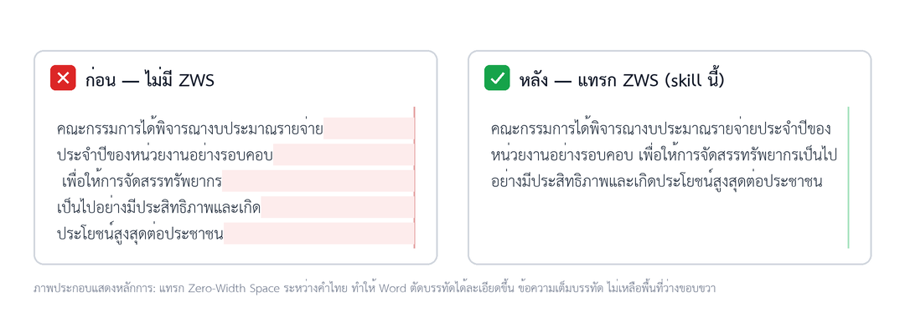

# Thai DOCX 🇹🇭📄 (ฉบับเบสิก)

> สร้างไฟล์ Word (.docx) ภาษาไทยให้ **เขียนเต็มบรรทัด ฟอนต์ถูกต้อง** — ใช้ฟรี ไม่ต้องแอดไลน์ใคร ไม่ต้องจ่ายเงิน

[](LICENSE)
[](https://www.python.org/)

เครื่องมือสร้างเอกสาร Word ภาษาไทยด้วย Python ที่แก้ปัญหาคลาสสิก 2 ข้อซึ่งโปรแกรมสร้าง .docx ทั่วไปทำพลาด เปิดเป็นโอเพนซอร์สให้ใช้และแก้ไขได้อิสระ



> 📦 **นี่คือฉบับเบสิก (branch `thai-docx`)** เหมาะกับคนทั่วไป ไฟล์เล็ก เน้นแก้ข้อความไทยให้เต็มบรรทัด
> ถ้าต้องการ**ฉบับเต็มสำหรับข้าราชการ** (รวมฟอนต์แห่งชาติ + preset เอกสารราชการ/สารบรรณ + สารบัญ/ตาราง/เลขหน้า)
> ดูที่ branch [`main`](../../tree/main)

---

## ปัญหาที่แก้ให้

### 1. ภาษาไทยตัดบรรทัดก่อนเวลา → เสียพื้นที่ขอบขวา
ภาษาไทยไม่มีช่องว่างระหว่างคำ Word เลยไม่รู้ว่าจะตัดบรรทัดตรงไหน มักตัดเร็วเกินไปจนเกิดบรรทัดสั้น ๆ
**แก้โดย** แทรก Zero-Width Space (U+200B) ระหว่างคำไทย (ตัดคำด้วย [PyThaiNLP](https://github.com/PyThaiNLP/pythainlp)) — มองไม่เห็น แต่บอก Word ว่าตัดบรรทัดตรงไหนได้บ้าง

### 2. ฟอนต์ไทยไม่เปลี่ยนตามที่สั่ง
`python-docx` ตั้งฟอนต์ผ่าน `run.font.name` ให้แค่ฝั่งอังกฤษ (`w:ascii`/`w:hAnsi`) **ไม่ตั้งฝั่ง Complex Script (`w:cs`) ที่อักษรไทยใช้จริง** — ผลคือบางเครื่องฟอนต์ไทยไม่เปลี่ยนเลย
**แก้โดย** ตั้งฟอนต์ผ่าน XML ให้ครบทุกฝั่ง รวมขนาด (`w:szCs`) และตัวหนา/เอียง (`w:bCs`/`w:iCs`)

---

## ความสามารถ

- ✅ ข้อความไทยเต็มบรรทัด ไม่ตัดก่อนเวลา
- ✅ ฟอนต์ไทยถูกต้องทุกเครื่อง (แก้บั๊ก Complex Script)
- ✅ หัวเรื่อง/หัวข้อย่อย, ย่อหน้า, bullet/เลขข้อ, ตาราง, รูปภาพ
- ✅ ตัวหนา `**...**` / ตัวเอียง `*...*` แบบ markdown
- ✅ ใช้ได้ทั้งแบบ CLI และเรียกจากโค้ด Python

---

## ติดตั้ง

```bash
git clone -b thai-docx https://github.com/Netthip/Thai-docx-for-A-Thai-civil-servant-eager-to-learn.git
cd Thai-docx-for-A-Thai-civil-servant-eager-to-learn
pip install -r requirements.txt
```

> ต้องมีฟอนต์ไทย (เช่น **TH Sarabun New** ที่มากับ MS Office) ติดตั้งในเครื่องที่เปิดไฟล์
> หรือเปลี่ยนฟอนต์ผ่านพารามิเตอร์ `--font` — ถ้าต้องการฟอนต์แห่งชาติแบบแถมมาในรีโป ดู branch `main`

---

## ใช้งานเร็ว (CLI)

```bash
python scripts/thai_docx.py input.md -o output.docx --title "รายงานประจำปี"
```

รูปแบบไฟล์ input (markdown ง่าย ๆ): `#` `##` `###` = หัวข้อ, `-`/`*` = bullet, `1.` = เลขข้อ, `**ตัวหนา**`

## ใช้งานผ่านโค้ด Python

```python
from thai_docx import create_docx

paragraphs = [
    {"text": "รายงานการทดสอบ", "type": "title"},
    {"text": "บทที่ ๑ บทนำ", "type": "heading1"},
    {"text": "เนื้อหาภาษาไทยที่รองรับ **ตัวหนา** และ *ตัวเอียง*", "type": "body"},
    {"text": "วัตถุประสงค์ข้อแรก", "type": "bullet"},
]

create_docx(paragraphs, "output.docx", font_size=16, line_spacing=1.5)
```

ดูตัวอย่างเต็มที่ [`examples/example_report.py`](examples/example_report.py)

---

## ชนิดของ paragraph

`title` · `subtitle` · `heading1`–`heading3` · `body` · `bullet` · `number` · `quote` · `caption` · `table` · `image` · `pagebreak`

---

## License

[MIT](LICENSE) — ใช้ฟรี แก้ไขได้ แจกจ่ายได้ ทั้งงานส่วนตัวและเชิงพาณิชย์

## ขอบคุณ

- [PyThaiNLP](https://github.com/PyThaiNLP/pythainlp) — การตัดคำภาษาไทย
- [python-docx](https://github.com/python-openxml/python-docx) — การสร้างไฟล์ Word

หากเครื่องมือนี้มีประโยชน์ ฝากกด ⭐ Star และช่วยแชร์ต่อ เพื่อให้คนไทยได้ใช้เครื่องมือดี ๆ ฟรี ๆ กันครับ
